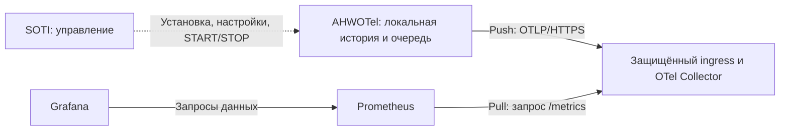
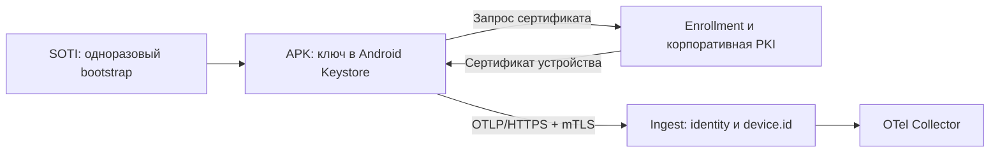
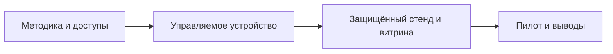

# AHWOTel: мониторинг производительности корпоративных Android-устройств

Скелет презентации · 9 слайдов · около 20 минут · редакция от 2026-09-14.

Готовые материалы: [PowerPoint с иллюстрациями и заметками](AHWOTel-Project-Overview.pptx) · [PDF](AHWOTel-Project-Overview.pdf). [Исходники и сборка](presentation-assets/README.md).

**Аудитория:** ИТ-руководство и технические эксперты. **Решение по итогам:** согласовать пилот, устройство под SOTI, доступ к Knox и стенд приёма телеметрии.

**Оформление:** Engineering Architecture, 16:9, светлый фон, тёмный текст, синий акцент для архитектуры. На слайд переносится блок «На экране» и предложенный визуал; заметки и источники остаются у докладчика. Числа на сравнительных графиках появляются только после измерений. Статусы обозначаются текстом, а не одним цветом:

- **Реализовано** — функция есть в APK.
- **Проверено** — есть результат для указанной среды и сценария.
- **Следующий этап** — целевое поведение, которое предстоит реализовать или проверить.

Основание: три проектных ТЗ, история Git и отчёты испытаний. ТЗ описывают целевой контур; наличие требования не означает его реализацию. Пятница, суббота и подготовка ТЗ в 07:30 — хронология со слов автора; время коммитов подтверждено Git, часовой пояс — Москва, UTC+03:00.

## Слайд 1. Определить, когда устройство мешает выполнять работу

**Назначение:** связать техническую диагностику с оценкой потерь рабочего времени. **Статус:** следующий этап — бизнес-методика; реализовано — сбор технических признаков.

### На экране

**От жалобы «устройство тормозит» — к интервалам проблем и обоснованным решениям.**

- Отдельный агент наблюдает за ресурсами; бизнес-приложение остаётся без изменений.
- Бизнес-критерий: операция не выполнена, завершилась ошибкой или заняла больше согласованного времени.
- Технические признаки: дефицит CPU, нехватка RAM, заполнение хранилища, температурные ограничения.
- Результат: минуты недоступности и деградации в рабочие часы, эпизоды, затронутые устройства, полнота наблюдения.
- Выводы: какие модели, настройки и условия эксплуатации требуют изменений.

### Визуал

Четыре горизонтальные дорожки на общей временной оси: **рабочие часы → состояние бизнес-операции → технические признаки → итоговые интервалы**. Разными обозначениями выделить подтверждённую недоступность, техническую деградацию и отсутствие наблюдений. Макет иллюстративный, без вымышленных результатов измерений.

### Заметки докладчика

Цель — идентифицировать состояния и интервалы, когда ресурсы устройства могли ограничивать работу. Техническая деградация сама по себе не доказывает невозможность бизнес-операции и не устанавливает причинность. Возможны проблемы сервера, сети или бизнес-приложения, которые ресурсный агент полностью не наблюдает.

В пилоте бизнес-эксперт определяет операцию и критерии успеха, источник подтверждения отказов, календарь и часовой пояс. Отдельно согласуются пороги и минимальная длительность технических состояний. Нынешний APK не измеряет бизнес-операции и не рассчитывает их недоступность по рабочему календарю.

Целевая методика: время недоступности — длительность объединения подтверждённых интервалов, пересечённого с рабочими часами. Одновременные причины не удваивают общий простой одного устройства. Техническая деградация считается отдельно. Пропуски наблюдений не приравниваются ни к нормальной работе, ни к простою; показатель покрытия сопровождает итог. Для парка сумма по устройствам выражается в устройстве-минутах.

**Источники:** [основное ТЗ](../TZ_Android_Performance_Monitoring.txt), разделы 1, 15, 23, 30; бизнес-методика — согласованное направление пилота.

## Слайд 2. Доступность метрик зависит от устройства, Android и прав

**Назначение:** объяснить границы измерений и необходимость матрицы совместимости. **Статус:** реализовано; проверено на конкретных устройствах, не на всём парке.

### На экране

**Android позволяет наблюдать ресурсы, но не даёт любому APK полный доступ к системе.**

| Группа | Доступные сведения при поддержке источника | Ограничение интерпретации |
| --- | --- | --- |
| Память | Общая и доступная RAM, сигнал low memory | Не объясняет автоматически поведение бизнес-приложения |
| Хранилище | Ёмкость и свободное место | Заполненность не измеряет скорость I/O |
| Батарея | Заряд, температура, состояние; ток и счётчик заряда при поддержке | Ток относится ко всему устройству; качество зависит от модели |
| Thermal | Тепловой статус и запас до ограничения при поддержке API | Набор источников зависит от версии Android и устройства |
| CPU | CPU агента; проверка системного источника; косвенные задержки | Общесистемная загрузка не гарантирована |

**Правило:** проверка из APK → доступный источник или предусмотренный fallback → явный статус. `UNSUPPORTED` не равен нулю.

### Визуал

Таблица выше занимает основную часть слайда. Справа компактная связка: **sandbox · версия Android · OEM/прошивка · корпоративные права**. Полную матрицу «показатель × модель» оставить для пилота, не заполнять предположениями.

### Заметки докладчика

Sandbox — изоляция приложений: Android ограничивает доступ к системе и чужим данным. Разрешения диагностической оболочки ADB не равны разрешениям установленного APK. Поэтому проверки выполняются непосредственно из рабочего потока приложения.

В AHWOTel есть попытка чтения `/proc/stat`; при отказе системная загрузка CPU остаётся недоступной. CPU wait отражает ожидание выполнения потока пробы при доступном источнике, а Probe scheduling delay — задержку запуска пробы. Эти показатели публикуются отдельно: их нельзя переименовывать в системный CPU или считать доказательством его перегрузки. Причины задержек могут различаться.

Отказ одной метрики не останавливает всю сессию. Диагностика сохраняет источник, статус, причины отказа и использование fallback. Память агента и память устройства также различаются по области измерения. Единицы, ограничения и интерпретация объясняются в EN/RU-подсказках приложения; по умолчанию интерфейс English.

**Источники:** [основное ТЗ](../TZ_Android_Performance_Monitoring.txt), разделы 7–14, 24; [описание MVP и CPU](../README.md); [Android Application Sandbox](https://source.android.com/docs/security/app-sandbox).

## Слайд 3. Knox расширяет наблюдение при наличии поддерживаемых API и прав

**Назначение:** показать дополнительную ценность OEM и условия её получения. **Статус:** реализован OEM-контур; расширенные Knox-чтения требуют управляемого стенда.

### На экране

**Knox — дополнительный источник корпоративного контекста устройства.**

- Сведения об устройстве, платформе и корпоративной конфигурации.
- Инвентарь приложений и доступные сведения об ограничениях.
- Политики USB, камеры, Bluetooth, Wi-Fi и установки приложений.
- Контекст безопасности и сети — в пределах конкретного API и разрешений.
- Единый формат сохраняет источник и статус; Android-сбор продолжает работу без Knox.

### Визуал

Два слоя: **Android Standard** и **Samsung Knox**. Над Knox — цепочка условий: **модель → версия API → права → лицензия, если нужна → успешный вызов из APK**.

Выносной блок: **SM-J260F: библиотека обнаружена; нужный публичный метод определения API отсутствует. Расширенные Knox-чтения не подтверждены.**

### Заметки докладчика

OEM — производитель устройства. Его SDK может давать дополнительные корпоративные интерфейсы. Это не универсальный доступ к системным счётчикам и не обход sandbox. Регистрация в Knox Developer и наличие библиотеки не выдают APK необходимые права автоматически.

На тестовом Samsung SM-J260F, Android 8.1, провайдер сообщил `API_NOT_SUPPORTED`: отсутствовал требуемый публичный `getAPILevel()`. Для соответствующих значений зафиксированы `UNSUPPORTED / METHOD_MISSING`. Это результат конкретного адаптера на конкретной модели, а не вывод о всём Samsung-парке. Системный CPU и температура процессора через Knox в текущем MVP не подтверждены.

SOTI управляет развёртыванием и политиками; Knox Service Plugin (KSP) применяет поддерживаемые OEM-настройки. Их привилегии не передаются AHWOTel автоматически. Для выбранных методов отдельно проверяются версия, разрешения и лицензирование. Текущий адаптер не поддерживает старое пространство имён Knox 2.x; добавление такой совместимости не запланировано.

**Источники:** [OEM/Knox ТЗ](../android_oem_extended_telemetry_knox_mvp_TZ.txt); [контракт OEM](oem-telemetry.md); [проверка Knox из APK](VALIDATION-OEM-code6.md); [Samsung: лицензии Knox SDK](https://docs.samsungknox.com/dev/knox-sdk/introduction/about-licenses/).

## Слайд 4. Сам агент должен показывать стоимость своей работы

**Назначение:** объяснить Self Telemetry и способ проверки влияния измерений. **Статус:** реализован локальный сбор; сравнительная оценка нагрузки — задача пилота.

### На экране

**Мониторинг не должен незаметно становиться причиной наблюдаемой проблемы.**

- Ресурсы агента: CPU, память, трафик, база и очередь отправки.
- Внутренняя работа: длительность сборщиков, задержки задач, ошибки и повторы.
- WakeLock: сколько времени агент удерживает CPU от засыпания.
- Профили: частый сбор для диагностики; редкий сбор медленно меняющихся параметров.
- Сравнение версий и настроек при одинаковых моделях и сопоставимой рабочей нагрузке.

### Визуал

Три режима в колонках: **агент выключен / обычный профиль / интенсивная диагностика**. Строки: CPU, память, трафик, WakeLock, разряд батареи. Вместо неподтверждённых чисел — «измерить в пилоте». Влияние режимов показать после контролируемого сравнения.

### Заметки докладчика

Self Telemetry — наблюдение приложения за собственным потреблением и операциями. Интервалы сбора и отправки настраиваются независимо; медленно меняющиеся сведения не требуют постоянного частого опроса. Режим диагностики управляется настройками: Off по умолчанию, Basic и временный Verbose. Структурированные логи поступают в stdout/stderr, Android Logcat и при включении в ротируемый JSONL; чувствительные данные не должны попадать в диагностику.

Батарейные ток и счётчик заряда относятся ко всему устройству. Разряд зависит также от экрана, сети, других приложений и состояния аккумулятора. Влияние агента оценивается сравнением режимов и совокупностью признаков; прямое измерение его энергопотребления в mAh не заявляется. Измерение собственной стоимости Self Telemetry не должно порождать рекурсивные события.

Ориентир ТЗ: Self Telemetry — менее 5% общей нагрузки самого агента. Это целевой бюджет, а не подтверждённое достижение и не допустимая доля ресурсов всего телефона. Способ сравнения и условия измерения фиксируются в пилоте. Серверное сравнение версий, регрессионные оповещения и Battery Impact Score ещё не являются готовой витриной.

**Источники:** [Self Telemetry ТЗ](../self_telemetry_android_TZ.txt), разделы 10–12, 20, 25–30, 35; [контракт Battery/Self](battery-self-telemetry.md); [результаты Samsung](VALIDATION-samsung-code11.md).

## Слайд 5. OpenTelemetry связывает APK с готовой инфраструктурой наблюдения

**Назначение:** объяснить OTel, OTLP, push/pull и расширяемость без привязки к одному backend. **Статус:** реализована опциональная отправка; внешний стенд — следующий этап.

### На экране

- **OpenTelemetry:** API, SDK и компоненты для метрик, логов и трассировок; хранение и графики обеспечивают другие системы.
- **OTLP:** протокол передачи; в AHWOTel используется HTTP + protobuf через HTTPS.
- **Push:** телефон инициирует отправку, включая работу за NAT и в мобильной сети.
- **Pull:** сервер опрашивает доступный endpoint; на стенде Prometheus запрашивает метрики Collector.
- **Расширения:** приём → обработка → экспорт; отдельно — аутентификация и служебные функции Collector.

### Визуал



Стрелки показывают инициатора запроса или команды; ответы Collector → Prometheus и Prometheus → Grafana подразумеваются. Так видна разница между push телефона и pull внутри серверного контура. Входящий доступ из Интернета к APK не требуется.

### Заметки докладчика

OpenTelemetry поддерживает разные сигналы, но это не означает, что текущий APK отправляет все их виды. Основной экспорт AHWOTel — метрики. SDK формирует данные, OTLP переносит их, Collector принимает и обрабатывает, Prometheus хранит метрики, Grafana показывает результат. OTLP существует поверх HTTP и gRPC; наш вариант — HTTP, а не gRPC.

В Collector receivers принимают данные, processors фильтруют, преобразуют или группируют их, exporters передают дальше. Служебные extensions, например аутентификация, подключаются отдельно; конкретный набор зависит от сборки Collector. Сборщики внутри APK — самостоятельный слой и не являются серверными плагинами. Для выбранного OTLP-пути custom receiver не требуется.

Сейчас APK работает автономно: история по умолчанию 14 дней, есть ограничение хранилища, графики, экспорт и опциональная очередь отправки. При отключённом OTLP внешний сервер для локального режима не нужен. При потере сети очередь сохраняется в заданных пределах; переполнение и истечение срока означают возможную потерю старых данных, а не бесконечное хранение.

На Samsung проверен сценарий с локальным HTTPS mock server: 1000 пакетов, 100 ответов HTTP 503, повторы, ограничение числа задач, смена endpoint и отключение экспорта. Это не доказательство приёма корректных метрик реальным Collector и отображения в Grafana. Такое сквозное подтверждение входит в следующий этап. Основной вариант стенда — Prometheus + Grafana; VictoriaMetrics остаётся альтернативой хранения при отдельном выборе.

**Источники:** [основное ТЗ](../TZ_Android_Performance_Monitoring.txt), разделы 3, 16–19, 23; [результаты OTLP-теста](VALIDATION-samsung-code11.md); [What is OpenTelemetry](https://opentelemetry.io/docs/what-is-opentelemetry/), [OTLP](https://opentelemetry.io/docs/specs/otlp/), [компоненты и конфигурация Collector](https://opentelemetry.io/docs/collector/configuration/).

## Слайд 6. Сервер должен доверять устройству и проверять его device.id

**Назначение:** разделить защиту канала, аутентификацию и авторизацию. **Статус:** HTTPS реализован; аутентификация устройства и enrollment — следующий этап.

### На экране

**Кто отправил данные — и за какое устройство он вправе их публиковать?**

- HTTPS защищает канал и позволяет проверить сервер.
- Целевой вариант: mTLS, индивидуальный сертификат устройства, закрытый ключ в Android Keystore.
- Авторизация приёма: удостоверенная identity соответствует заявленному `device.id`.
- Жизненный цикл: регистрация → выдача → обновление → индивидуальный отзыв.
- Альтернатива из ТЗ: короткоживущий JWT после аутентификации устройства; общий постоянный секрет в APK не используется.

### Визуал



Подпись: целевой контур. Закрытый ключ остаётся на устройстве. Завершение mTLS — на Collector либо доверенном ingress; место выбирается при проектировании стенда.

### Заметки докладчика

Аутентификация отвечает на вопрос «кто отправитель», авторизация — «какие данные ему разрешено публиковать». Проверка сертификата сервера без удостоверения клиента не решает вторую задачу. IP непригоден как стабильная identity мобильного устройства; корпоративный `device.id` связывается с учётной записью SOTI.

По ТЗ при первом запуске создаётся ключ в Android Keystore и запрос сертификата. PKI — инфраструктура выпуска и управления сертификатами. Одноразовый bootstrap credential доставляется через SOTI, ограничивается временем и устройством, после регистрации не используется повторно. Нужны обновление и отзыв доступа конкретного устройства. Доступ APK к ключам, распространённым SOTI, нельзя предполагать без отдельного PoC.

Альтернатива — короткоживущий JWT с идентификатором устройства, адресатом и сроком действия. Выдачу токена и доверенную проверку нужно построить отдельно; включение готового authentication extension само по себе не создаёт этот контур. Доступ пользователей к Grafana — отдельная авторизация, не заменяющая аутентификацию APK.

В текущем MVP реализованы HTTPS и проверка сертификата сервера; mTLS, enrollment и JWT-аутентификация устройства отсутствуют. Также предстоит проверить авторизацию команд SOTI. Ни лицензионные ключи Knox, ни bootstrap/token/private key не передаются в телеметрии и логах.

**Источники:** [основное ТЗ](../TZ_Android_Performance_Monitoring.txt), разделы 6, 18, 25–28; [ограничения MVP](../README.md); [Collector Authentication](https://opentelemetry.io/docs/collector/configuration/#authentication).

## Слайд 7. Vibe coding: от обсуждения до работающего APK за выходные

**Назначение:** показать скорость прототипирования вместе с границами подтверждённого результата. **Статус:** хронология автора + проверенная история Git и испытаний.

### На экране

| Время, Москва | Этап | Что получено |
| --- | --- | --- |
| Пт, 11.09 | Консультации | Обсуждение актуальности задачи и вариантов приёма телеметрии |
| Сб, 12.09 | «Делать или не делать?» | Обдумывание идеи |
| Вс, 13.09, 07:30 | Три блока ТЗ; старт репозитория | Производительность, OEM/Knox, Self Telemetry; `9bfecfb` — LICENSE |
| 14:01 | Первый функциональный коммит `5a8710d` | Автономный APK: метрики, история, графики, EN/RU-подсказки |
| 20:42 | Второй функциональный коммит `beaf486` | OEM/Knox, Battery/Self, оси графиков, настройки; исправления таймера, экспорта, очереди и WakeLock |
| Вечер после коммита | Проверки на Samsung | Обновление APK, новая сессия; 20 отдельных native-сценариев, включая OTLP |

Подпись мелким текстом: **Подготовка и консультации — со слов автора. Коммиты — по Git. Испытания — по отчётам, с учётом повторных проверок.**

### Визуал

Горизонтальная временная шкала с крупными отметками 07:30, 14:01 и 20:42. Пятницу и субботу объединить в блок подготовки, вечерние проверки — в отдельный блок после Git. Таблица задаёт содержание отметок и не добавляется второй плотной таблицей на тот же слайд.

### Заметки докладчика

Три ТЗ охватывают разные области:

1. [TZ_Android_Performance_Monitoring.txt](../TZ_Android_Performance_Monitoring.txt) — ресурсы и состояния устройства, сессии, SOTI, OTLP и безопасность.
2. [android_oem_extended_telemetry_knox_mvp_TZ.txt](../android_oem_extended_telemetry_knox_mvp_TZ.txt) — OEM-провайдеры, Samsung Knox, права, политики и расширенная телеметрия.
3. [self_telemetry_android_TZ.txt](../self_telemetry_android_TZ.txt) — стоимость самого агента, сравнение конфигураций и версий.

Точные времена Git: `9bfecfb` — 2026-09-13 07:30:31 +03:00; `5a8710d` — 14:01:39; `beaf486` — 20:42:51. Первый коммит содержит только LICENSE. Основное ТЗ впервые зафиксировано в 14:01, OEM и Self — в 20:42. Хронология подготовки трёх ТЗ в 07:30 основана на словах автора; Git не подтверждает время их создания. Время коммита показывает фиксацию результата, а не начало или длительность каждой работы.

Первая функциональная поставка — `00.00.00.01`; вторая — `00.00.00.02`, Android `versionCode=11`. Второй коммит включает managed configuration, независимые настройки и историю Battery/Self, графики с осями, исправления применения таймера, агрегации, полноты истории, навигации, экспорта и планирования OTLP.

20 native-сценариев — число отдельных успешно проверенных сценариев на Samsung с учётом повторов, а не один полностью успешный общий прогон. Сетевой тест с локальным HTTPS mock server прошёл за 36,616 секунды. Установка APK и результаты после коммита не выдаются за доказанные самим Git push. Полный корпоративный контур остаётся задачей пилота; лицензированный Knox, реальный SOTI и внешний Collector не подтверждены этим набором проверок.

Практический урок: после синхронизации даты телефона с 2018 на 2026 год старые записи удалились по сроку хранения. Это произошло до повторного OTLP-теста; резервные копии остались на компьютере. Проверка времени и поведения retention входит в программу пилота. Быстрая разработка не отменяет испытаний на реальных устройствах.

**Источники:** Git `log/show` для трёх коммитов; [состав первой поставки](VALIDATION-00.00.00.01.md), [второй поставки](VALIDATION-00.00.00.02.md), [последующие проверки Samsung](VALIDATION-samsung-code11.md); хронология подготовки — автор проекта.

## Слайд 8. Следующий результат — управляемый пилот с общей витриной

**Назначение:** получить решение о ресурсах пилота и зафиксировать проверяемый результат. **Статус:** следующий этап.

### На экране

**Устройство под SOTI безопасно передаёт наблюдения; оператор видит сессию, проблемы и стоимость мониторинга.**

- **Методика:** бизнес-операция, критерии недоступности, рабочий календарь и полнота данных.
- **Доступы:** Knox Developer и необходимые лицензии; аккаунт Google developer по выбранному маршруту распространения.
- **Устройство:** Samsung под SOTI; проверка установки, настроек, START/STOP и прав самого APK.
- **Стенд и витрина:** защищённый ingest, OTel Collector, Prometheus, Grafana.
- **Приёмка:** сквозная сессия, offline/reconnect, timeout, нагрузка агента и сохранность данных при изменении времени.

### Визуал



Нижняя плашка: **Нужны устройство и доступ к SOTI, владелец стенда/PKI, бизнес-эксперт.** Сроки не указывать до подтверждения этих ресурсов.

### Заметки докладчика

Для Knox: зарегистрироваться в портале разработчика, выбрать модель и версии, сопоставить требуемые API с правами и лицензиями, затем проверить их реальными вызовами AHWOTel. Для устройства под SOTI подтвердить применимый Android Enterprise enrollment и способ запуска команд. Наличие Fully Managed или KSP само по себе не доказывает доступ к getters из нашего APK.

Для Google развести способы распространения. Google Play Console относится к публикации через Google Play; для распространения вне Play предусмотрена Android Developer Console. Private apps на управляемых Android Enterprise устройствах сейчас освобождены от Android developer verification. Поэтому платную регистрацию или публикацию в Play не считать обязательной предпосылкой установки через SOTI. До оформления аккаунта проверить маршрут поставки и требования к разрешениям текущего APK, включая инвентаризацию приложений. Политики могут меняться; сведения сверены по документации Google при подготовке материала.

Для стенда: проверить выбранную аутентификацию устройства и сопоставление `device.id`, настроить Collector и хранение в Prometheus, построить Grafana-витрины ресурсов, доступности источников и Self Telemetry. Разрезы: устройство, модель, Android, версия агента, профиль и сессия. Серверная витрина бизнес-недоступности появляется после согласования методики и источника бизнес-событий.

Критерий технической приёмки: оператор через SOTI запускает диагностическую сессию, в Grafana появляются метрики с корректными identity и временем; агент сохраняет ограниченную очередь при отключении сети, отправляет после восстановления и завершает сессию по timeout. Отказ отдельного источника виден оператору и не останавливает остальные сборщики. Отдельные проверки: отзыв доступа одного устройства, влияние частоты измерений, screen-off, скачок часов, границы срока хранения и восстановление из резервной копии. История на телефоне ограничена и не заменяет серверное хранение.

До эксплуатации нужно отдельно спроектировать сроки хранения и резервирование данных/конфигурации стенда, восстановление PKI и доступов. Эти вопросы не представляются уже решённой отказоустойчивой архитектурой.

**Источники:** [основное ТЗ](../TZ_Android_Performance_Monitoring.txt), разделы 29–31; OEM/Knox и Self Telemetry ТЗ; [Samsung: получение лицензии](https://docs.samsungknox.com/dev/knox-sdk/get-started/get-a-license/); [Google: private apps и developer verification](https://support.google.com/work/android/answer/17266330?hl=en), [Android developer verification FAQ](https://developer.android.com/developer-verification/guides/faq).

## Слайд 9. Затраты: около 200 млн токенов и 1–2 часа участия человека

**Назначение:** показать вычислительные затраты, участие автора и условную денежную оценку прототипа. **Статус:** токены и лимит — по журналам Codex; время человека — оценка автора; деньги — расчётная доля подписки.

### На экране

**Автоматизация выполняла разработку и проверки; человек задавал требования и принимал решения.**

- **200,4 млн токенов** суммарно: основная сессия 188,9 млн + семь агентов review 11,5 млн.
- **199,4 млн входных / 1,01 млн выходных**; 96,8% входных прочитаны из кэша.
- **1–2 часа активного участия человека:** ТЗ, планы и review, разрешение следующих шагов, проверки телефона — по оценке автора.
- **50% недельного лимита Pro** использовано; статус подтверждает расход лимита учётной записи.
- **Около $23–25 условной доли подписки** при $200/месяц. Это распределение фиксированной платы, не отдельное списание и не API-счёт.

### Визуал

Три крупные карточки: **200,4 млн токенов / 1–2 часа человека / ≈ $23–25**. Под токенами — полоса состава: вход из кэша, остальной вход, выход. Под денежной карточкой — «50% недельного лимита; условная доля подписки». Нижняя подпись: **Снимок 14.09.2026, 08:17 МСК; включает подготовку презентации до снимка.**

### Заметки докладчика

**Что измерено.** В настройке status line включены `used-tokens`, `total-input-tokens`, `total-output-tokens` и недельный лимит. Для отчёта прочитаны соответствующие накопительные поля `total_token_usage` и `rate_limits` из локальных событий `token_count`, а не результат `/caveman-stats`. Зафиксирован снимок на 2026-09-14 08:17:15 МСК. Позднейшая работа над этим слайдом в него не входит.

| Счётчик | Основная сессия | Семь агентов review | Всего |
| --- | ---: | ---: | ---: |
| Входные токены (`input_tokens`) | 187 957 681 | 11 451 206 | 199 408 887 |
| Из них вход из кэша (`cached_input_tokens`) | 182 512 384 | 10 581 888 | 193 094 272 |
| Выходные токены (`output_tokens`) | 956 023 | 50 819 | 1 006 842 |
| Всего (`total_tokens`) | 188 913 704 | 11 502 025 | 200 415 729 |

Токен — единица текста, обрабатываемая моделью, не строка кода и не отдельный пользовательский запрос. Вход включает многократно передаваемый контекст, инструкции и результаты инструментов. Поэтому 200,4 млн не означают столько уникального текста или нового кода. Некэшированный вход — 6 314 615 токенов; кэш уже включён во вход и повторно не прибавляется. Reasoning-токены, 418 627 по сумме журналов, являются частью выхода и тоже не прибавляются ещё раз.

Взято последнее накопительное значение каждого из восьми журналов на момент снимка; события `token_count` между собой не суммировались. Проверено, что каждый журнал начинает счёт с собственного первого запроса, сбросов нет, а прирост счётчика соответствует последнему запросу. Повторное чтение контекста разными агентами является реально зарегистрированным входом; это не число уникальных токенов. Снимок содержит разработку, проверки и подготовку презентации в данной сессии. Подготовка ТЗ в других чатах/инструментах и иная незафиксированная работа не учтены. Обезличенные числовые данные и методика сохранены в [снимке расхода](PRESENTATION-USAGE-2026-09-14.json).

**Время человека.** Автор оценил активное участие в **1–2 часа**, без ожидания агента. Раскладка ниже иллюстративная: общий диапазон подтверждён автором, отдельные этапы секундомером не измерялись.

| Этап | Ориентировочно |
| --- | ---: |
| Подготовка и уточнение трёх ТЗ | 20–40 минут |
| Чтение планов/review, уточнение приоритетов | 20–40 минут |
| Разрешение следующих шагов и короткие решения | 10–20 минут |
| Проверки телефона, USB/Wi-Fi и обратная связь | 10–20 минут |
| **Всего активного участия** | **60–120 минут** |

В основной сессии к снимку зафиксированы 49 пользовательских сообщений без служебных вставок, включая 10 явных запусков планов и 3 запроса review. Это подтверждает участие автора, но не измеряет длительность его работы и не учитывает каждое разрешение CLI. Календарная длительность разработки с ожиданием сборок, проверок и переподключением телефона существенно больше активного времени человека. Пятничные консультации отдельно не хронометрировались и к этой разбивке автоматически не прибавляются.

**Деньги.** Принята указанная автором цена подписки $200 в месяц. На снимке `plan_type=pro`, недельное окно — 10 080 минут, `used_percent=50`. Распределение месячной платы пропорционально доле недели даёт:

```text
По среднему числу недель: $200 × 12 / 52 × 50% ≈ $23,08.
При упрощении до четырёх недель в месяце: $200 / 4 × 50% = $25.
```

Недельный лимит — ограничение использования, а не кошелёк с фиксированной ценой токена. Подписка оплачивается целиком; $23–25 — условная управленческая оценка доли, отнесённой на проект, а не дополнительный платёж. Отнесение 50% к проекту дано автором: статус показывает общий расход учётной записи и сам по себе не исключает другие задачи. Цена Pro включает и другие возможности подписки. Прямой пересчёт этих токенов в API-стоимость здесь не выполняется: это другая модель оплаты. Стоимость труда человека, налоги, оборудование и эксплуатация стенда в $23–25 не включены.

**Источники:** [зафиксированные счётчики Codex и расчёт](PRESENTATION-USAGE-2026-09-14.json); оценка автора «около 1–2 часов»; [OpenAI: подписки и лимиты Codex](https://learn.chatgpt.com/docs/pricing); [OpenAI: status line и команды статуса](https://learn.chatgpt.com/docs/developer-commands?surface=cli). Данные подписки и ограничения проверены при подготовке слайда 2026-09-14.

## Редакторская проверка и вопросы пилота

Это служебный раздел документа, не десятый слайд.

- Первые восемь слайдов следуют согласованному порядку; девятый завершает презентацию оценкой затрат. Экранные тезисы отделены от технических заметок и источников.
- В затратах разделены счётчики токенов, расход общего лимита, оценка активного времени человека и условное распределение платы за подписку. Кэш и reasoning не прибавлены к итогам повторно.
- Бизнес-недоступность, техническая деградация и отсутствие данных не смешиваются. Рабочий календарь и критерии операции пока требуют согласования.
- Нет заявления о доступном системном CPU через Knox, готовой клиентской аутентификации, доказанном бюджете Self Telemetry или работающей внешней витрине.
- Коммиты, записи ТЗ и проверки после Git-поставки разведены по времени и источникам. Данные испытаний — снимок состояния на 2026-09-13, не текущая диагностика телефона.
- Для пилота остаются конкретные решения: бизнес-операция и её источник событий; модель/enrollment SOTI; API и права Knox; маршрут распространения APK; PKI и владелец стенда; протокол сравнения нагрузки и политика времени/хранения. Их отсутствие не маскируется демонстрационными числами.
